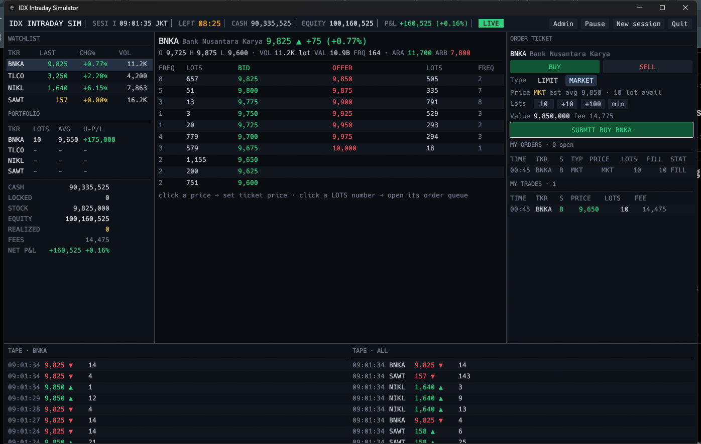
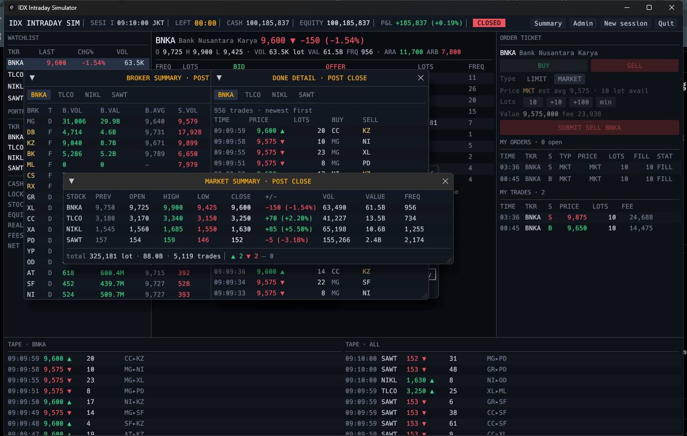

# idx-game-sim

[](https://github.com/lemkova/idx-game-sim/actions/workflows/ci.yml)
[](https://github.com/lemkova/idx-game-sim/releases/latest)
[](LICENSE)

An intraday stock-trading simulator game styled after the Indonesia Stock
Exchange (IDX). You get **Rp 100,000,000** and one 10-minute session to trade
four fictional stocks against a live agent-driven market — a market maker,
retail flow, foreign algo programs, and domestic whales — all matched through
a real price-time-priority limit order book.



## Download (Windows)

Grab `idx-game-sim-windows-x64.zip` from the
[latest release](https://github.com/lemkova/idx-game-sim/releases/latest),
unzip, and run `idx-game-sim.exe`. No installer, no dependencies.

## Gameplay

- **Session**: 10 minutes of simulated trading, opening 09:00 JKT. When the
  bell rings, open orders are pulled and your P&L is scored.
- **Stocks**: `BNKA` Bank Nusantara Karya, `TLCO` Telekom Cakrawala,
  `NIKL` Nikel Lautan, `SAWT` Sawit Tunas Abadi — each with its own
  personality (spread, depth, retail flow, whale behavior).
- **IDX mechanics**: 1 lot = 100 shares, real tick-size ladder, ARA/ARB
  auto-reject price bounds, and realistic buy/sell fees.
- **Order book**: full depth with per-level order queues — click a LOTS
  number to inspect the live queue at that price.
- **Real intraday anonymity**: like the real IDX, broker codes and
  foreign/domestic investor types are *hidden* while the market trades.
  Your own orders are always marked `YOU`.

### Post-close reports

After the close everything is revealed, IDX-style:

- **Broker Summary** — per-stock buy/sell volume, value, and average price by
  broker, with foreign/domestic flags.
- **Done Detail** — the complete session tape, print by print, with both
  broker codes.
- **Market Summary** — OHLC, change, volume, value, and frequency for the
  whole board.



### Admin window

The `Admin` button opens a control panel where you can set your cash balance
and toggle intraday broker-code visibility if you'd rather play with full
transparency.

### Controls

| Key / action | Effect |
|---|---|
| `1`–`4` | Switch stock |
| `B` / `S` | Open buy / sell ticket |
| `P` | Pause / resume |
| `N` | New session (after close) |
| Click a book price | Prefill ticket price |
| Click a LOTS number | Open that level's order queue |

## Build from source

Requires [Rust](https://rustup.rs/) (stable).

```sh
cargo run --release
```

Useful flags:

```sh
cargo run --release -- --seed 42        # reproducible session
cargo run --release -- --headless 120   # no UI: run 120s and print market stats
```

## How the market works

Each stock runs an independent matching engine with four agent types:

- **Market maker** (`MG`) — quotes a ladder around a random-walk fair value.
- **Retail** — a stream of small orders, mixing passive quotes and
  market-taking flow.
- **Foreign algo** (`KZ`, `BK`, `RX`, …) — episodic buy/sell programs that
  work large parents in clips, moving price directionally.
- **Domestic whale** (`DX`, `SQ`, …) — reloads a wall on one side
  (accumulation or distribution) on configured stocks.

Every trade prints to the tape; the session log backs the post-close reports.

## License

[MIT](LICENSE) © Lemkova
